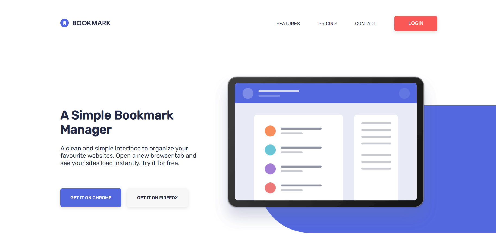

# Bookmark Landing Page

This is a solution to the [Bookmark landing page challenge on Frontend Mentor](https://www.frontendmentor.io/challenges/bookmark-landing-page-5d0b588a9edda32581d29158). 

## Overview

### The challenge

Users should be able to:
- View the optimal layout for the site depending on their device's screen size (Desktop & Mobile responsive).
- See hover states for all interactive elements on the page.
- Receive an error message when the newsletter form is submitted if the email field is empty or formatted incorrectly.
- Interact with a fully functional custom tab-slider for the Features section.
- Open and close an accordion in the FAQ section.
- Open and close a smooth full-screen mobile navigation menu.

### Screenshot

### Built with

- Semantic HTML5 markup
- CSS custom properties (Variables)
- Flexbox
- Vanilla JavaScript for DOM manipulation

